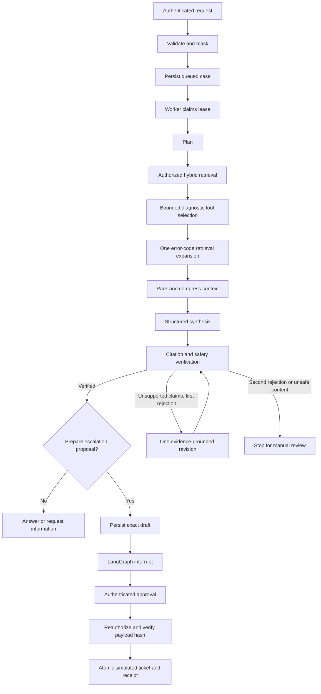

# Architecture and decision record

## Trust boundaries

The browser is untrusted. Identity comes from a fixed demo store or verified OIDC subject; membership and role come from the database. `authorize_account` reloads membership for every retrieval/tool call. An opaque case UUID is not authorization. Case reads, traces, approvals and execution all enforce membership. Tenant-level runbooks are shared among authorized accounts within that tenant; this version does not model per-document group ACLs.

A model can request diagnostics and propose findings. It cannot set the current tenant, approve a draft, execute arbitrary commands, choose arbitrary network targets, or create a ticket directly. Provider credentials are read from deployment configuration and never enter graph state.

## Request flow

## Persistence and concurrency

The case table is a durable job queue with atomic conditional updates. A worker claims queued cases or cases whose leases have expired. One worker thread is active per application instance. PostgreSQL permits multiple instances to compete for claims; use one API worker process in the supplied local deployment to keep initialization simple. A lease lasts at least 300 seconds and the workflow's default deadline is 90 seconds. This is a bounded-work assumption, not a distributed fencing guarantee. A production connector that may exceed the lease needs periodic renewal and a fencing token.

LangGraph writes separate checkpoints keyed by server-generated case IDs. Nodes may replay. All diagnostics are read-only; mutation happens after the approval interrupt. Resume reads the persisted decision from the database rather than trusting the graph's resume payload. The approval endpoint uses compare-and-set and records the approver, exact payload hash, timestamp, and expiry.

Ticket creation, action receipt and audit event use one transaction in the simulator. This demonstrates exactly-once local state changes under duplicate attempts. It does **not** claim exactly-once delivery to remote APIs. A real connector requires an outbox/ledger, a provider-supported idempotency key, and lookup/reconciliation after an ambiguous timeout. If the provider offers neither, record `unknown` and stop for manual reconciliation.

The initial schema has an Alembic migration. Checkpoint schema migrations are managed by the LangGraph checkpointer's `setup()`. Application releases that change serialized graph state must keep old state readable or migrate/drain pending cases before deploy.

## Models and context

The model gateway performs structured planning, native tool selection, synthesis and a separate grounding verdict. Transient failures get at most two attempts per configured route. A circuit opens for 30 seconds after repeated transient failures. Schema failures get one repair; persistent schema failures stop. Refusals, configuration errors and authorization failures do not trigger provider shopping.

Budgeting reserves 1,400 output tokens plus a conservative instruction/schema reserve. The context packer chooses the smaller configured primary/fallback context window, subtracts the request, and caps selected evidence. Its UTF-8 byte accounting is conservative for byte-level tokenizers and intentionally sacrifices utilization to preserve an offline demo. Accurate per-provider tokenization is an extension point.

Documents use heading-aware chunks and parent-section expansion. In demo mode vector similarity uses deterministic token hashing; this is a lexical baseline. Live mode uses configurable 256-dimensional API embeddings. PostgreSQL performs vector ranking and English full-text ranking with tenant/version filters before evidence reaches the model. SQLite scans eligible rows in memory. Reciprocal-rank fusion and a lexical-overlap reranker combine candidates. Exact search is used on the initial small corpus; approximate indexes are a future scale optimization that must be evaluated under ACL filters.

Compression is extractive, prioritizes warnings and query terms, and preserves exact selected text. Tool JSON is kept intact or omitted. Citation checks verify references and literal quotes. This establishes provenance, not entailment. Live mode runs an additional semantic judge over claims, summary and recommendations; judges can still be wrong. The judge receives the original request as intent and a trusted description of the pre-execution workflow state. The escalation flag requests a reviewable proposal; it does not assert that escalation is mandatory. A first grounding/provenance rejection enters one durable revision node using unchanged evidence and redacted feedback. The complete revised answer is checked again. Repeated rejection stops without a draft; sensitive output and provider safety refusals never enter this correction path. Revision count is checkpointed and the same overall deadline applies.

## Security and telemetry

Threats covered by tests include cross-tenant object access, tool argument scope changes, unapproved writes, stale/different approvals, revoked memberships, unsupported citations, injected documents, sensitive output, and provider refusals. Regex screening is not a complete injection or PII detector. The enforceable boundaries are authorization, narrow tool schemas, no generic execution/fetch tools, and exact human-approved writes.

Evidence and checkpoints contain redacted data but still require access control, retention and encrypted storage in a real deployment. Application traces contain routing/timing/count metadata only. Guardrails built-in telemetry and raw-content tracing are disabled. Audit events are distinct from sampled OpenTelemetry spans; the local database is not an immutable/WORM audit system.

## Deliberate trade-offs

- A modular monolith and database-backed worker reduce operational overhead for a portfolio-sized system.
- SQLite enables a no-services demo; PostgreSQL/pgvector is the intended deployment profile.
- A single explicit graph is easier to inspect and replay than a team of autonomous agents.
- Human approval occurs after a complete reviewable draft, before the single supported mutation.
- No response cache is used, avoiding stale authorization and sensitive cache-key mistakes at this stage.
- Polling is used for UI updates. SSE/event delivery becomes worthwhile with many concurrent users.
- OIDC verification exists; a full provider-specific SSO user experience is outside the reference implementation.
